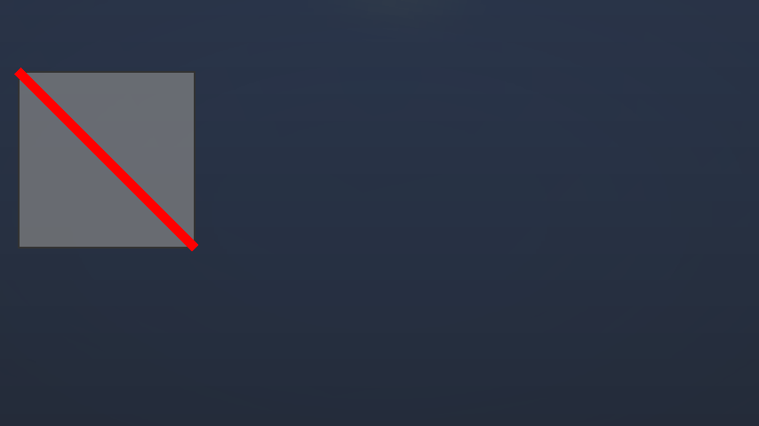
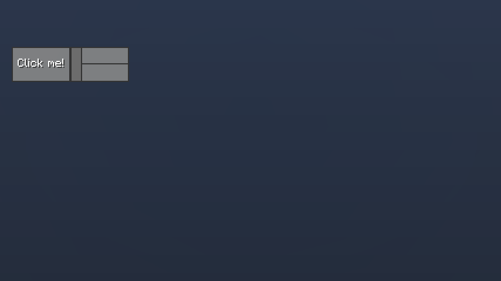
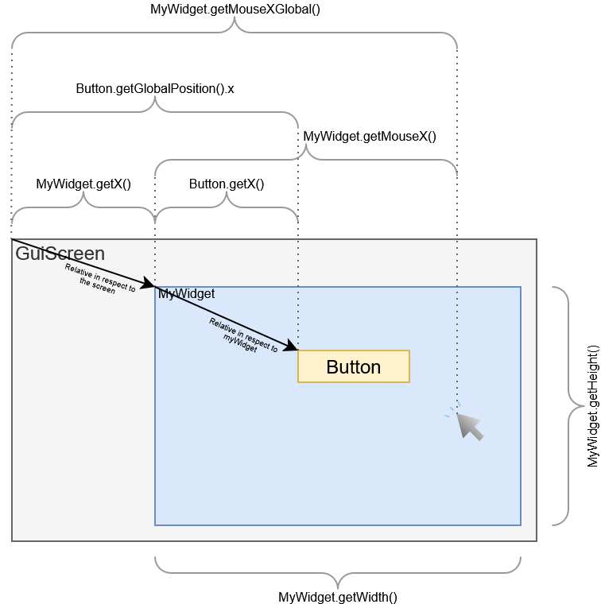
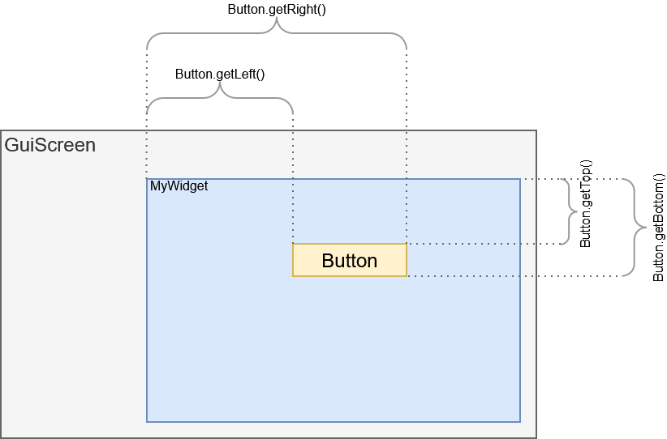
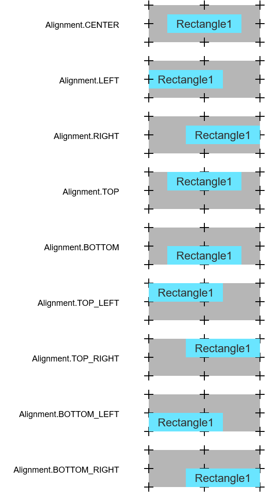
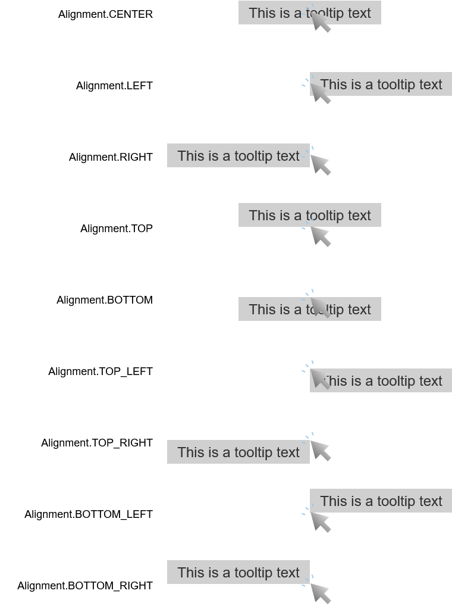

# Gui Element
This is the most important class for the Gui Library, each element which is visible on the screen is defined as a GuiElement.


---
## Content
- [Predefined Gui Elements](#predefined-gui-elements)
- [Defining a custom Gui Element](#defining-a-custom-gui-element)
  - [Layouting](#layouting)
  - [Rendering](#rendering)
  - [User interactions](#user-interactions)
    - [Mouse events](#mouse-events)
    - [Key press events](#key-press-events)
  - [Tooltips](#tooltips)
  - [Retrieve positioning data](#retrieve-positioning-data)
    - [Mouse position](#mouse-position)
    - [Position and size](#position-and-size)
  - [Play sound](#play-sound)

---
### Predefined Gui Elements
- EmptyButton
- [Button](GuiElements/Button.md)
- CloseButton
- CheckBox
- ContainerView
- Frame
- [ListView](GuiElements/ListView.md)
- Slider
- InventoryView
- ItemSelectionView
- ItemView
- Label
- Plot
- TabElement
- TextBox
- TextureElement
- DropDownMenu
- ExpandablePanel
  


---
### Defining a custom Gui Element
A Gui Element can contain multiple child elements which need to be added using the `addChild()` methode.
In this example things are simple by using no child elements and just drawing a line from the left top corner to the bottom right.


``` Java
class MyElement extends GuiElement
{
    int lineColor = ColorUtilities.getRGB(255, 0, 0);
    float lineThickness = 5;
    public MyElement()
    {

    }
    @Override
    protected void render() {
        drawLine(0, 0, getWidth(), getHeight(), lineThickness, lineColor);
    }

    @Override
    protected void layoutChanged() {

    }
}
```

This code shows how to add the element to a GuiScreen
``` Java
public class TestScreen extends GuiScreen {
    private final MyElement myElement;
    public TestScreen()
    {
        super(Component.translatable("TEST"));

        myElement = new MyElement();
        addElement(myElement);
    }

    @Override
    protected void updateLayout(Gui gui) {
         myElement.setBounds(10, 40, 100, 100);
    }
}
```

<tr>
<td>
<div align="center">
     
</div>
</td>

The background and the border of a Gui Element is drawn by default but it can be disabled using the methodes:
- `GuiElement.setEnableBackground(true/false);`
- `GuiElement.setEnableOutline(true/false);`

---
#### Layouting
Layouting is a very important part of the Gui Library, the location and size of every element need to be defined.
For this example the `MyElement` uses some child elements which need to be layouted.

``` Java
class MyElement extends GuiElement
{
    private final Button button;
    private final Slider slider;
    public MyElement()
    {
        button = new Button("Click me!");
        slider = new HorizontalSlider();

        addChild(button);
        addChild(slider);
    }
    @Override
    protected void render() {

    }

    @Override
    protected void layoutChanged() {
        int width = getWidth();   // Get the width of this component
        int height = getHeight(); // Get the height of this component 

        // Set the bounding box to position (0,0) with the size (width/2, height).
        button.setBounds(0, 0, width/2, height);

        // Use the button as a constraint for setting the X-Position directly to 
        // the right edge of the button.
        slider.setBounds(button.getRight(), 0, width/2, height);
    }
}
```

This code shows how to add the element to a GuiScreen
``` Java
public class TestScreen extends GuiScreen {
    private final MyElement myElement;
    public TestScreen()
    {
        super(Component.translatable("TEST"));

        myElement = new MyElement();
        addElement(myElement);
    }

    @Override
    protected void updateLayout(Gui gui) {
        // This will trigger a relayout of the "myElement" object.
        myElement.setBounds(10, 40, 100, 30); 
    }
}
```

<tr>
<td>
<div align="center">
     
</div>
</td>

---
**Lets focus on the layouting part**<br>
The coordinate system used in a GuiElement is always relative to the position of the Gui Element. So setting the coordinate of a child to (0,0) will position that child in the top left corner.
If you move that instance of `MyElement` inide the screen for example, then the childs will move too.
The size of a GuiElement is usually defined by the parent which layouts the element, because of that only child elements are adjusted to fit the size of the  `MyElement` instance.
If the parent, who instantiated the `MyElement`, changes the size of that instance, then the `layoutChanged()` method will be triggered on the changed element in order for that to relayout its childs.

<tr>
<td>
<div align="center">
     
</div>
</td>


The methods `getTop()`, `getBottom()`, `getLeft()`, `getRight()`, `getBounds()`, `getSize()`, `getPosition()`, `getWidth()`, `getHeight()` are usefull functions to use for layouting.
Elements can be constrained to be dependant on positions and sizes of other elements that way.

<tr>
<td>
<div align="center">
     
</div>
</td>

``` Java
class MyElement extends GuiElement
{
    ...
    @Override
    protected void layoutChanged() {
        int width = getWidth();   // Get the width of this component
        int height = getHeight(); // Get the height of this component 

        // Set the bounding box to position (0,0) with the size (width/2, height).
        button.setBounds(0, 0, width/2, height);

        // Use the button as a constraint for setting the X-Position directly to 
        // the right edge of the button.
        slider.setBounds(button.getRight(), 0, width/2, height);
    }
}
```

---
**GuiElement.getAlignedBounds(...)**
A rectange can be aligned to a positon of a other rectangle using the `getAlignedBounds()` methode.<br>
`Rectangle getAlignedBounds(x1, y1, width1, height1, alignment, x2, y2, width2, height2)`
Takes a rectangle1 defined by "x1", "y1", "width1", "height1" and a rectangle2defined by "x2", "y2", "width2", "height2" and then returns a rectangle
that is the same size as rectangle1 but moved inside rectangle2 according to the specified alignment.
It moves the rectangle1 inside rectangle2 so that it is aligned according to the specified alignment.
It return s the new bounds of the rectangle, aligned according to the specified alignment.<br>
This figure below shows the result.
Rectangle1 is the first defined rectangle of the function and the gay rectangle in the background is the second define rectangle of the function (x2, y2, width2, height2)

<tr>
<td>
<div align="center">
     
</div>
</td>


---
#### Rendering
Renderin takes part in three methodes but the `renderGizmos()` is mostly not even used.


``` Java
class MyElement extends GuiElement
{
    ...
    @Override
    protected void renderBackground()
    {
        super.renderBackground();
        // Draw background stiff like filling the background of a element
    }
    @Override
    protected void render() 
    {
        // Render foreground stuff
    }
    @Override
    protected void renderGizmos() 
    {
        super.renderGizmos();
        // Used for debugging, will be rendered by pressing the F3 key
    }
}
```

##### Drawing tools
- `drawLine(startPoint, endPoint, thickness, color)`
- `drawRect(x, y, width, height, color)`
- `drawFrame(x, y, width, height, color, thickness)` draws line around the given rectangle
- `drawText(String/Component, position, color, dropShadow(true/false), alignment, fontscale)`
- `drawGradient(x, y, width, height, fromColor, toColor)`
- `drawItem(ItemStack, position)` without the amount of the item stack
- `drawItemWithDecoration(ItemStack, position)` draws the amount of the item stack too
- `drawTexture(texture, pos)`
- `drawTooltip(...)`

If special drawing is needed which is not provided by the GuiElement, the 
`PoseStack` instance can be used.<br>

``` Java
PoseStack poseStack = getPoseStack();
// Draw custom stack using the raw pose stack
``` 

Push and pop pose will create like a new stack frame for translations
After a pose gets pushed, any translation made afterwards is saved on that new stackframe and if it gets poped, the old translations are active again.

- `graphicsPushPose()` equal to `poseStack.pushPose()`
- `graphicsPopPose()` equal to `poseStack.popPose()`
  
> [!CAUTION] 
> Always make sure to pop as often as you push


- `graphicsTranslate(x,y,z)` equal to `poseStack.translate(x,y,z)`
- `graphicsTranslate(x,y)` equal to `poseStack.translate(x,y,0)`
- `graphicsScale(x,y,z)` equal to `poseStack.scale(x,y,z)`
- `graphicsScale(x,y)` equal to `poseStack.scale(x,y,1)`
- `graphicMulPose(quaternion)` equal to `poseStack.mulPose(quaternion)`
- `graphicsRotateAround(quaternion,x,y,z)` equal to `poseStack.rotateAround(quaternion,x,y,z)`

###### Scissor
The scissor can be used to disable rendering over a specific rectangle area.
All rendering outside that area will be cut off.
> [!CAUTION] 
> Always make sure to disable the scissor after it was used.

- `enableScissor(x, y, width, height)`
- `enableScissor(rectangle)`
- `enableScissor()` Uses the elements bounds as scissors rectangle.
- `enableGlobalScissor(rectangle)` does not convert the given rectangle from local coordinate space to global coordinate space. The input rectangle is in global coordinate space.
- `disableScissor()` Disables the scissor
- `scissorPause()` Disables the scissor but will keep the rectangle in cache
- `scissorResume()` Will enable the scissor with the rectangle used when it was paused.

---
#### User interactions
Some methodes require a return value, true or false.
If the event was consumed, return true.
If the event was not consumed, return false.
In the case a event was not consumed, it will be propagated further to the child elements.

##### Mouse events
You can overwrite the following methods to receive mouse events:
- `mouseClicked(int button)` Gets triggered when ever a mouse button is clicked anywere on the screen.
  
- `mouseReleased(int button)` Gets triggered when ever a mouse button is released anywere on the screen.

- `mouseClickedOverElement(int button)` Gets triggered when ever a mouse button is clicked over that specific GuiElement. 
  > Return true if the event was consumed, otherwise false 

- `mouseReleasedOverElement(int button)` Gets triggered when ever a mouse button is released over that specific GuiElement. 
  > Return true if the event was consumed, otherwise false 

- `mouseDragged(int button, double deltaX, double deltaY)` Gets called when the mouse is pressed and moved anywere on the screen
  
- `mouseScrolled(double delta)` Gets called when the mouse wheel was rotated anywere on the screen.
  
- `mouseScrolledOverElement(double delta)` Gets called when the mouse wheel was rotated anywere on the screen.
  > Return true if the event was consumed, otherwise false 


##### Key press events
You can overwrite the following methods to receive key press events:
- `keyPressed(int keyCode, int scanCode, int modifiers)`
  > Return true if the event was consumed, otherwise false 

- `charTyped(char codePoint, int modifiers)`
  > Return true if the event was consumed, otherwise false 
---
#### Tooltips
Call `drawTooltip(...)` to draw a tooltip, there are many different implementations for this method.<br>
You can create a tooltip the following way:
- Using a String, Component or a ItemStack for the text source.
- The position of the tooltip needs to be specified.
- Custom text color can be used.
- Enabeling/Disabeling of the tooltip background.
- Background color can be specified.
- The fontscale can be adjusted.
- You can specify the position-layout of the tooltip.
  That means you can specify the position of the tooltip in respect to the given location and layout.
- A full custom tooltip object can be passed: `TooltipData`.


This image shows how the Alignment for the tooltip works:
<tr>
<td>
<div align="center">
     
</div>
</td>

#### Retrieve positioning data
##### Mouse position
- `getMouseX()` Returns the relative mouse x-coordinate in respect to this element.
- `getMouseY()` Returns the relative mouse y-coordinate in respect to this element.
- `getMousePos()` Returns the relative mouse coordinate in respect to this element.
- `getMouseXGlobal()` Returns the absolute mouse x-coordinate.
- `getMouseYGlobal()` Returns the absolute mouse y-coordinate.
- `isMouseOver()` Returns true if the mouse is hovering over this element.

##### Position and size
- `getX()` Returns the relative x-coordinate in respect to its parent.
- `getY()` Returns the relative y-coordinate in respect to its parent.
- `getPosition()` Returns the relative coordinate in respect to its parent.
- `getWidth()` Returns the width of this element.
- `getHeight()` Returns the height of this element.
- `getSize()` Returns the size of this element.
- `getBounds()` Returns the rectangle which defines the location and size of this element relative in respect to its parent.
- `getGlobalPositon()` Returns the coordinate of this elem in respect to the screen.
- `getTextWidth(string)` Returns the width used to dispaly the given string using the font scale of this gui element.
- `getTextHeight()` Returns the width used to dispaly a string using the font scale of this gui element.


<tr>
<td>
<div align="center">
     
</div>
</td>

---
#### Play sound
Different sounds can be found here: `SoundEvents.XY`
- `playLocalSound(sound, volume, pitch)`

``` Java
playLocalSound(SoundEvents.UI_BUTTON_CLICK.value(),0.5F);
``` 