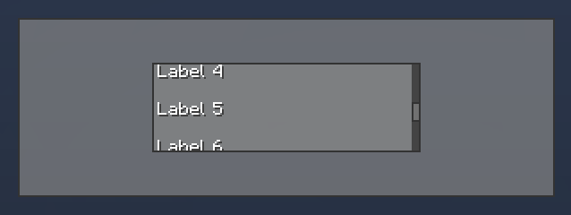
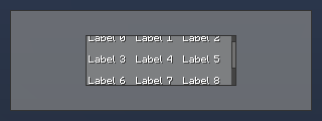

# ListView

## Features
* Displays a list of GuiElements in a specific layout and frame that can be scrolled.

## Variants
* `VerticalListView`
* `HorizontalListView`


---
### Usage
``` Java
public class MyElement extends GuiElement {
    private final ListView listView;
    public MyElement()
    {
        listView = new VerticalListView();
        Layout layout = new LayoutVertical();
        layout.stretchX = true; // will resize the childe's width
        listView.setLayout(layout);

        for(int i = 0; i < 10; i++)
        {
            Label label = new Label("Label " + i);
            label.setHeight(20);
            listView.addChild(label);
        }

        addChild(listView);
    }

    @Override
    protected void layoutChanged() {
        int width = getWidth();
        int height = getHeight();

        listView.setBounds(width/4, height/4, width/2, height/2);
    }
}
```


<tr>
<td>
<div align="center">
     
</div>
</td>

---
LayoutGrid is also supported
``` Java
public class MyElement extends GuiElement {
    private final ListView listView;
    public MyElement()
    {
        listView = new VerticalListView();
        LayoutGrid layout = new LayoutGrid(); // Use a grid layout
        layout.stretchX = true; // will resize the childe's width
        layout.columns = 3;
        listView.setLayout(layout);
        ...
    }
}
```

<tr>
<td>
<div align="center">
     
</div>
</td>

---
### Customisation
- `setScrollbarBackgroundColor(color)`
- `setScrollbarThickness(thickness)` 

