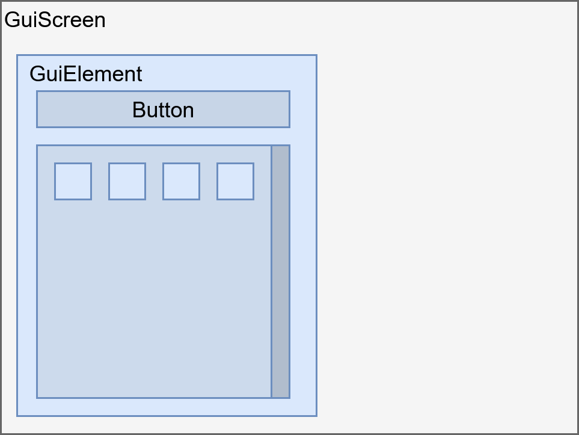

# GUI Library

## Overview

The GUI library is a fast and easy way to create screens in Minecraft. It uses a hierarchical tree structure to organize elements displayed on the screen. The library is designed to be compatible across multiple Minecraft versions, abstracting away version-specific GUI code changes.

<tr>
<td>

     

</td>

## Prerequisites

Before using the GUI library, you should understand:
- Basic Minecraft client-side screen concepts
- Component-based UI design patterns
- How to create and register network packets (if opening GUIs from server)

## Key Features

- Hierarchical element tree structure
- Cross-version compatibility
- Built-in layout management
- Debug visualization tools (F3-F6 keys)
- Rich set of pre-built components
- Custom element support

## Content

### Core Classes
- [GuiScreen](GuiScreen.md) - Base screen implementation for standalone GUIs
- [GuiContainerScreen](GuiContainerScreen.md) - Screen implementation for inventory-based GUIs
- [GuiElement](GuiElement.md) - Base widget class for all GUI components

### Available GUI Elements

**Interactive Elements:**
  - [Button](GuiElements/Button.md) - Standard clickable button
  - EmptyButton - Button without visual representation
  - CloseButton - Pre-configured close button
  - CheckBox - Toggle checkbox element
  - Slider - Value slider control
  - TextBox - Text input field
  - DropDownMenu - Selection dropdown

**Display Elements:**
  - Label - Text display
  - TextureElement - Image/texture display
  - Plot - Data visualization chart
  - ItemView - Single item display
  - ContainerView - Container/inventory display

**Container Elements:**
  - Frame - Generic container for grouping elements
  - [ListView](GuiElements/ListView.md) - Scrollable list container
  - InventoryView - Player inventory display
  - ItemSelectionView - Item selection grid
  - TabElement - Tabbed container

**Note:** Documentation is currently available for core classes and select elements (marked with links). Full documentation for all elements is in progress.

## See Also

- [Documentation Index](../README.md) - Main documentation index
- [Sandbox System](../development/Sandbox.md) - GUI testing examples
- [Networking Library](../networking/Networking.md) - For opening GUIs from server