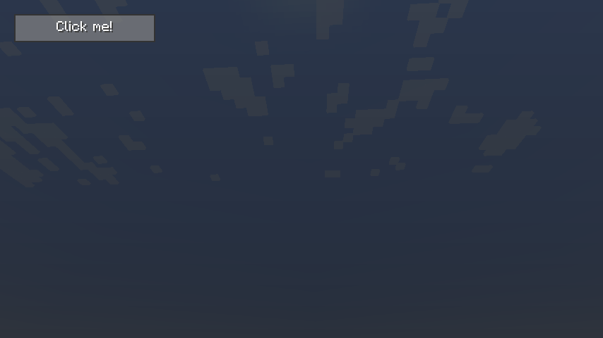
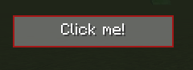

# GuiScreen

## Overview

The GuiScreen class is used to create graphical user interfaces that are not associated with any inventory (unlike chest GUIs, for example). If you need an inventory to be displayed, use [GuiContainerScreen](GuiContainerScreen.md) instead.

The GuiScreen is the foundation for GUI creation. It needs to be populated with GuiElements (widgets) such as buttons, list views, or custom components.

## Prerequisites

- Basic understanding of the [GUI Library](GuiLibrary.md)
- Knowledge of Minecraft's Screen class
- Understanding of component lifecycle (construction, layout, rendering)

---
## Content
- [Example implementation](#example-implementation)
- [Open a screen](#open-a-screen)
- [Close a screen](#close-a-screen)
- [Manage multiple screens](#manage-multiple-screens)
- [Adding Gui Elements to the screen](#adding-gui-elements-to-the-screen)
- [Debuging](#debuging)
- [Render order](#render-order)

---
## Example implementation
This is a minimal working implementation of a GuiScreen
It does not show any elements.

``` Java
public class TestScreen extends GuiScreen {
    public TestScreen()
    {
        super(Component.translatable("TEST"));
    }

    @Override
    protected void updateLayout(Gui gui) {

    }
}
```

---
## Open a screen
To open a screen, just create an instance of the screen and use the static `setScreen` method from the GuiScreen.
To be able to call this static function, the code must be run on the client side.
So if for example the server needs to open a screen, just send a network packet to the client in which the screen then gets opened once it arrives on the client side.
A good practice is to use one network packet to open all screens and provide the information, which screen to open, inside the network packet.
``` Java
public class TestScreen extends GuiScreen {
    public static void open()
    {
        GuiScreen.setScreen(new TestScreen());
    }
}
```

---
## Close a screen
- A screen gets closed when the player presses the `ESC` key.
- you call the `onClose()` or the `close()` method.

---
## Manage multiple screens
In some cases multiple screens are needed. Only one screen can be open at a time, but screens can be stacked hierarchically. The trick is to keep track of the parent screen inside the new opened screen to just switch back to the parent screen when the new created screen gets closed.
It is also possible to switch screens manually by just calling the `GuiScreen.setScreen()` method.
By passing a screen to the constructor of a ChildScreen will make sure that once the ChildScreen gets closed, the parent screen will be opened again to create the ilusion of going back to the old screen.

``` Java
public class ChildScreen extends GuiScreen {

    public ChildScreen(Screen parent)
    {
        super(Component.translatable("TEST"), parent);
    }
    public static void open(Screen parent)
    {
        GuiScreen.setScreen(new ChildScreen(parent));
    }
}
public class TestScreen extends GuiScreen {
    public TestScreen()
    {
        super(Component.translatable("TEST"));
    }
    public static void open()
    {
        GuiScreen.setScreen(new TestScreen());
    }
    private void openChildScreen()
    {
        ChildScreen.open(this); // Provide this as parent
    }
}
```

---
### Adding Gui Elements to the screen
Gui Elements are the Widgets which are drawn to the screen.


``` Java
public class TestScreen extends GuiScreen {
    private final Button myButton;
    public TestScreen()
    {
        super(Component.translatable("TEST"));

        myButton = new Button("Click me!");
        addElement(myButton); // add it to the screen
    }

    @Override
    protected void updateLayout(Gui gui) {
        myButton.setBounds(10, 10, 100, 20); // set the location and size of the button
    }
}
```


<tr>
<td>
<div align="center">
     
</div>
</td>

---

### Debuging
There are multiple debug keys defined which can help finding bugs in layouting or drawing stuff.
- **F3**: 
  Toggles the bounding boxes of all GuiElements with a red line. 
  This is perfect to see if something is wrong with the layouting code.

<tr>
<td>
<div align="center">
     
</div>
</td>

- **F4**:
  Toggles the background rendering.
- **F5**:
  Toggles the foreground rendering.
- **F6**:
  Toggles the tooltip rendering.    

These keys can be disabled using the `GuiScreen.setDebugKeysEnabled()` methode.
The toggeling of these keys can also be done using code.
- **F3**: `GuiScreen.setEnableGizmos(true/false);`
- **F4**: `GuiScreen.setEnableBackground(true/false);`
- **F5**: `GuiScreen.setEnableForeground(true/false);`
- **F6**: `GuiScreen.setEnableTooltip(true/false);`


### Render order
The Gui Screen renders in different steps:
1) Background which will be the `GuiElement.renderBackground()` for the child elements.
2) Foreground which will be the `GuiElement.render()` for the child elements.
3) Tooltips
4) Gizmos (Used for drawing the Bounding boxes which gets toggled by the **F3** Key). For the GuiElement it is the `GuiElement.renderGizmos()` which can be overwritten to draw custom stuff for debugging.

---
## See Also

- [GUI Library Overview](GuiLibrary.md) - Introduction to the GUI system
- [GuiContainerScreen](GuiContainerScreen.md) - For inventory-based screens
- [GuiElement](GuiElement.md) - Base class for all GUI widgets
- [Sandbox System](../development/Sandbox.md) - TestScreen implementation example